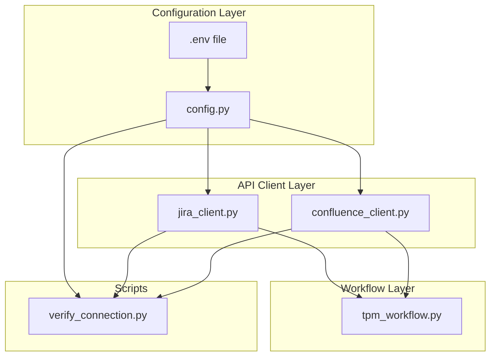

# Plan: Jira and Confluence Integration Tooling

## Context

- **Jira Data Center** at `https://jira.atl.workiva.net/`
- **Confluence Data Center** at `https://wiki.atl.workiva.net/`
- **Auth:** Personal Access Token (PAT) — sent as `Authorization: Bearer <token>` header
- **Language:** Python 3 with `requests` and `python-dotenv`
- The project directory (`dna_ai_tpm/`) is currently empty — building from scratch
- PATs may differ between Jira and Confluence since they are separate hosts, so the config supports independent tokens

### Architecture



### File Structure

```
dna_ai_tpm/
├── .env.example             # Template for secrets (never committed)
├── .gitignore               # Ignore .env, __pycache__, etc.
├── requirements.txt         # requests, python-dotenv
├── config.py                # Loads env vars, validates required settings
├── jira_client.py           # Jira Data Center REST API v2 client
├── confluence_client.py     # Confluence Data Center REST API client
├── tpm_workflow.py          # High-level TPM functions (triage, handoff, cross-ref)
├── verify_connection.py     # Connection test and field discovery script
└── README.md                # Setup and usage
```

## Implementation Steps

### Step 1: Project scaffolding and config

Create the foundational files:

- **`.gitignore`** — Exclude `.env`, `__pycache__/`, `*.pyc`, `.venv/`
- **`.env.example`** — Template with these vars:
  ```
  JIRA_BASE_URL=https://jira.atl.workiva.net
  JIRA_PAT=your-jira-personal-access-token
  CONFLUENCE_BASE_URL=https://wiki.atl.workiva.net
  CONFLUENCE_PAT=your-confluence-personal-access-token
  ```
- **`requirements.txt`** — `requests` and `python-dotenv`
- **`config.py`** — Loads `.env` via `dotenv`, exposes a `Settings` dataclass with `jira_base_url`, `jira_pat`, `confluence_base_url`, `confluence_pat`. Raises clear errors if required vars are missing. Strips trailing slashes from URLs.

### Step 2: Jira client module

`jira_client.py` — A `JiraClient` class initialized with `base_url` and `pat` from config.

| Method | HTTP | Endpoint | Purpose |
|--------|------|----------|---------|
| `myself()` | GET | `/rest/api/2/myself` | Auth check |
| `get_issue(key, fields=None)` | GET | `/rest/api/2/issue/{key}` | Fetch issue |
| `create_issue(payload)` | POST | `/rest/api/2/issue` | Create DNA ticket |
| `add_comment(key, body)` | POST | `/rest/api/2/issue/{key}/comment` | SLA / cross-ref comments |
| `get_transitions(key)` | GET | `/rest/api/2/issue/{key}/transitions` | List transitions |
| `transition_issue(key, transition_id)` | POST | `/rest/api/2/issue/{key}/transitions` | Close DATA ticket |
| `search(jql, fields=None, max_results=50)` | POST | `/rest/api/2/search` | JQL queries |
| `get_create_meta(project_key)` | GET | `/rest/api/2/issue/createmeta?projectKeys={key}&expand=projects.issuetypes.fields` | Discover fields/enums |

All methods:
- Set `Authorization: Bearer <pat>` and `Content-Type: application/json`
- Raise `requests.HTTPError` with response body on failure
- Return parsed JSON

### Step 3: Confluence client module

`confluence_client.py` — A `ConfluenceClient` class initialized with `base_url` and `pat`.

| Method | HTTP | Endpoint | Purpose |
|--------|------|----------|---------|
| `current_user()` | GET | `/rest/api/user/current` | Auth check |
| `get_page(page_id, expand="body.storage,version")` | GET | `/rest/api/content/{id}` | Read page |
| `create_page(space_key, title, body_html, parent_id=None)` | POST | `/rest/api/content` | Create page |
| `update_page(page_id, title, body_html, version_number)` | PUT | `/rest/api/content/{id}` | Update page |
| `search(cql, limit=25)` | GET | `/rest/api/content/search` | CQL search |

Same auth pattern as Jira client.

### Step 4: TPM workflow helpers

`tpm_workflow.py` — Functions that compose client methods for the core TPM process:

- **`assess_ticket(jira, issue_key)`** — Fetches a DATA ticket, checks for the 5 structured criteria (Goal/Service Type, Stakeholder Impact, Business Timeline, Data Domains, Structured Description). Returns a dict with `missing_criteria`, `suggested_priority`, and `sla_comment`.
- **`post_sla_comment(jira, issue_key, priority)`** — Posts the priority-mapped SLA auto-comment:
  - Blocker: "Reviewed immediately."
  - High: "Reviewed over the next business day."
  - Medium: "Reviewed in 2-3 business days."
  - Low: "Reviewed in 5 business days."
- **`build_dna_payload(data_issue, fields_override=None)`** — Builds the DNA ticket creation payload enforcing all data rules: exact enum strings, components as array, no reporter, no due date, empty string for missing optional fields.
- **`create_dna_ticket(jira, data_issue_key, dna_fields)`** — Creates the DNA ticket and returns the new key.
- **`cross_reference(jira, data_key, dna_key)`** — Posts a comment on both tickets referencing the other (plain text, not Jira link types).
- **`close_data_ticket(jira, issue_key)`** — Fetches available transitions, finds the "Done"/"Closed" transition, and executes it.

### Step 5: Connection verification script

`verify_connection.py` — Runnable with `python verify_connection.py`:

1. Load config
2. Test Jira auth via `myself()` — print username and display name
3. Test Confluence auth via `current_user()` — print username
4. Confirm access to DATA project (`search("project = DATA", max_results=1)`)
5. Confirm access to DNA project (`search("project = DNA", max_results=1)`)
6. Fetch and print create metadata for DNA project (required fields, allowed enum values)
7. Print a summary: green checkmarks for passes, red X for failures

### Step 6: Documentation and project memory

- **`README.md`** — How to generate PATs in Jira/Confluence Data Center, `.env` setup, install deps, run verification, and example usage of workflow functions.
- **Project memory** — Save Jira/Confluence URLs, project keys (DATA, DNA), and architecture decisions for future sessions.

## Verification

After implementation, run these checks:

1. `pip install -r requirements.txt` — deps install cleanly
2. `python verify_connection.py` — confirms auth and project access for both Jira and Confluence
3. Manual test: fetch a known DATA ticket with `jira.get_issue("DATA-XXX")`
4. Manual test: fetch a known Confluence page with `confluence.get_page("PAGEID")`

## Critical Files

- `config.py` — Central config; everything depends on it
- `jira_client.py` — Core Jira integration; most workflow operations go through this
- `confluence_client.py` — Confluence integration for knowledge base operations
- `tpm_workflow.py` — Business logic layer encoding the TPM rules from the system prompt
- `verify_connection.py` — First thing to run; validates the entire setup works
