# Plan: Triage, Groom, and Repair DATA + DNA Backlogs

## Context

### Current State (live data)

| Metric | DATA | DNA |
|--------|------|-----|
| Open tickets | 30 | 1,045 |
| Issue types | Task (30) | Story (164), Epic (158), Support (14), Task (7), Bug (3), Initiative (2) |
| Statuses | Open (30) | Open (166), In Progress (26), On Hold (6), QA (2) |

### DNA Field Violation Rates (sampled 200 tickets)

| Field | Missing | Rate |
|-------|---------|------|
| Stakeholder (cf[36420]) | 148 | 74% |
| Effort Points | 188 | 94% |
| Components | 123 | 62% |
| Team (cf[10288]) | 23 | 12% |
| Epic Link | 296 | (full count) |

All 158 open Epics are missing Stakeholder. Many Epics also missing Team.

### DATA Tickets
All 30 open DATA tickets are "Task" type with "Major" priority, predominantly Data Deletion requests. They appear to be operational service desk items rather than new feature requests requiring the 5-criteria intake assessment.

## Approach: Three Phases

```mermaid
flowchart LR
    subgraph phase1 [Phase 1: Triage DATA]
        AuditDATA["Audit 30 DATA tickets"]
        ClassifyDATA["Classify and prioritize"]
        SlaComment["Post SLA comments"]
        HandoffOrClose["Handoff to DNA or close"]
    end
    subgraph phase2 [Phase 2: Audit DNA]
        FullAudit["Full field audit all 1045"]
        GenerateReport["Generate violation report"]
        PrioritizeRepair["Prioritize repair batches"]
    end
    subgraph phase3 [Phase 3: Bulk Repair DNA]
        RepairEpics["Repair Epics first"]
        RepairIssues["Repair Issues"]
        ValidateFixes["Validate fixes"]
    end
    phase1 --> phase2 --> phase3
```

## Implementation Steps

### Phase 1: Triage all open DATA tickets

**Step 1: Build `audit_data.py` -- Full DATA backlog audit script**

Fetches all 30 open DATA tickets and produces a structured report:
- For each ticket: key, summary, priority, description presence, whether it maps to an existing DNA ticket (search for cross-references in comments)
- Classify each as: "Ready for handoff", "Needs context", or "Close (duplicate/stale)"
- Output as both console table and JSON for downstream processing

**Step 2: Build `triage_data.py` -- Interactive triage runner**

Script that walks through each DATA ticket needing action:
- Shows the ticket summary, description, and assessment
- Prompts for your decision: assign priority, post SLA comment, handoff to DNA, request info, or close
- Executes the chosen action via the Jira API
- For handoffs: calls `build_dna_payload` and `create_dna_ticket` with cross-referencing
- Logs all actions taken for audit trail

### Phase 2: Audit DNA backlog

**Step 3: Build `audit_dna.py` -- Full DNA field compliance audit**

Paginates through all 1,045 open DNA tickets (the search API caps at 200 per page, so this needs pagination) and checks every ticket against the DnA Ticket Requirements:
- Team present?
- Stakeholder present?
- Components present? (issues only)
- Effort Points present? (issues only)
- Epic Link present? (issues only)
- Epic Name present? (epics only)
- Summary format correct? (epics: `<Team> - <Quarter> - 
`)

Outputs:
1. **Summary stats** — violation counts by field and issue type
2. **Detailed CSV/JSON** — per-ticket violation list, ready for bulk repair
3. **Priority-ranked repair list** — Epics first (they block issue linking), then issues grouped by team

**Step 4: Build `groom_report.py` -- HTML/Markdown grooming report**

Generates a shareable report from the audit data:
- Violation heatmap by team and field
- Tickets that are stale (no updates in 30+ days)
- Tickets with no assignee
- Epics with no child issues
- Issues not linked to any Epic

### Phase 3: Bulk repair DNA tickets

**Step 5: Build `repair_dna.py` -- Bulk field repair script**

Three repair modes, each with dry-run preview before execution:

**Mode 1: Safe auto-fixes** (no human judgment needed)
- Set Stakeholder to a default/team-lead when determinable from Team field
- Set Components based on Epic parent's components (inherit from Epic)

**Mode 2: Prompted batch fixes** (human confirms per-batch)
- Effort points: present tickets grouped by likely size, you confirm the batch
- Epic linking: suggest Epic based on summary keyword matching, you confirm
- Team assignment: suggest Team based on Epic's team, you confirm

**Mode 3: Manual review queue** (needs individual attention)
- Tickets where no reasonable default can be inferred
- Output as a Jira-formatted bulk edit CSV or direct links

All repair operations:
- Run in dry-run mode first (show what would change, make no API calls)
- Log every change made (ticket key, field, old value, new value)
- Support `--execute` flag to actually apply changes
- Respect rate limits (throttle API calls)

### Step 6: Add `update_issue` method to Jira client

The current `jira_client.py` lacks a PUT method for updating existing issues. Add:
- `update_issue(key, fields)` -- `PUT /rest/api/2/issue/{key}`
- Needed for all repair operations

## Verification

- **Phase 1**: Run `audit_data.py` and verify counts match (30 tickets). Manually spot-check 3-5 tickets.
- **Phase 2**: Run `audit_dna.py` and verify total matches (1,045). Cross-check violation counts against the sampled numbers above.
- **Phase 3**: Run `repair_dna.py --dry-run` first. Review the proposed changes. Then run with `--execute` on a small batch (10 tickets) before scaling up.

## Critical Files

- [tpm_workflow.py](tpm_workflow.py) — Validation rules and constants that drive all auditing
- [jira_client.py](jira_client.py) — Needs `update_issue` method for repairs
- `audit_dna.py` (new) — Core audit logic with pagination for 1,045 tickets
- `repair_dna.py` (new) — Bulk repair with dry-run safety
- `audit_data.py` (new) — DATA triage assessment
